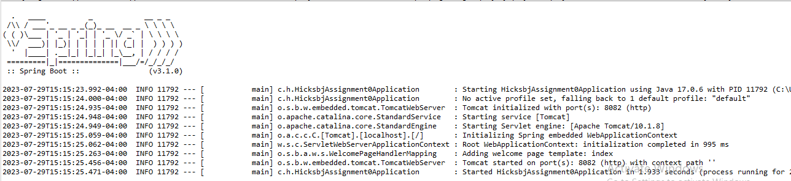
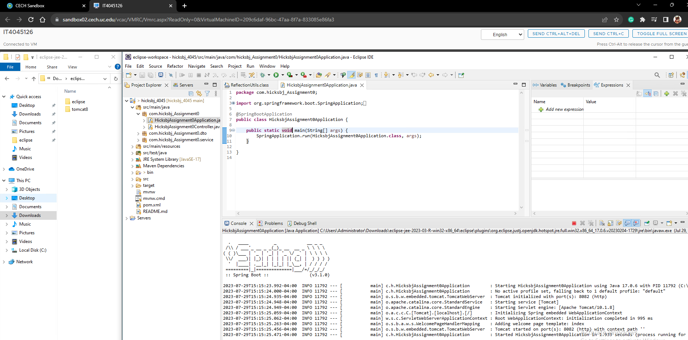
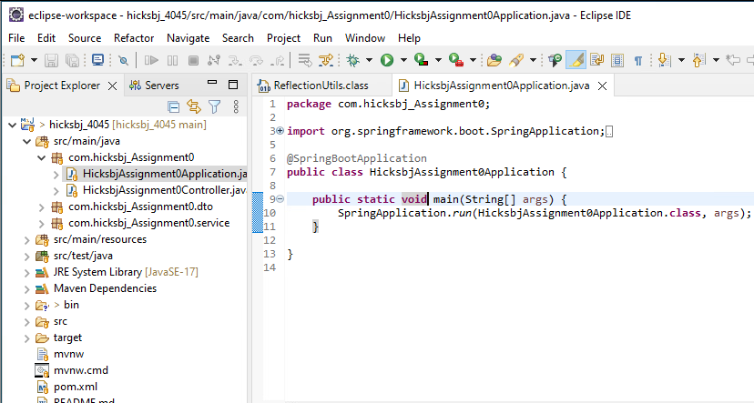
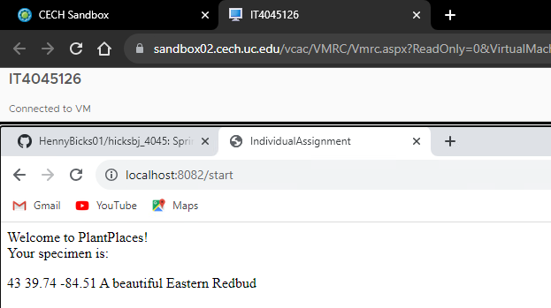
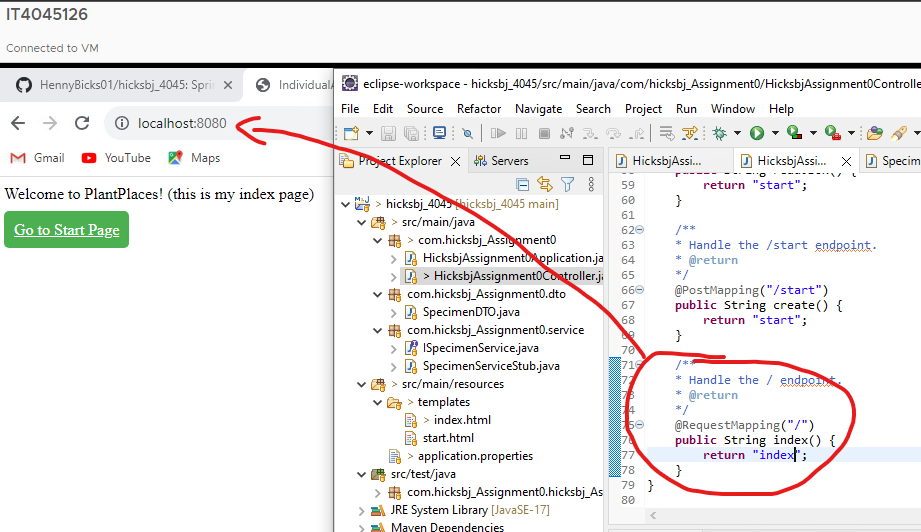
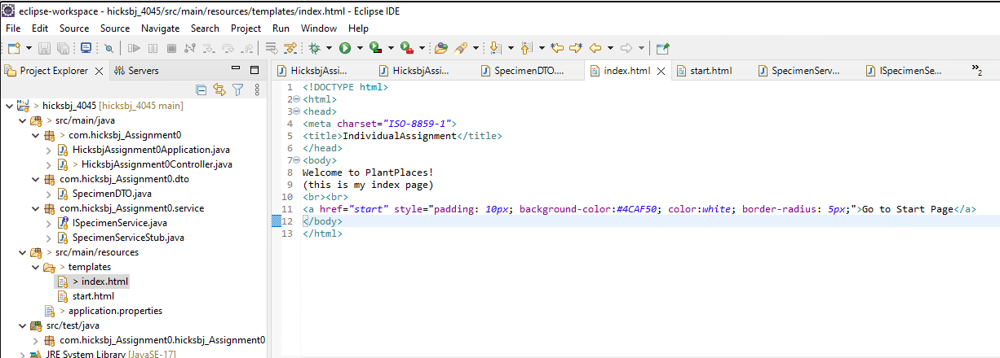
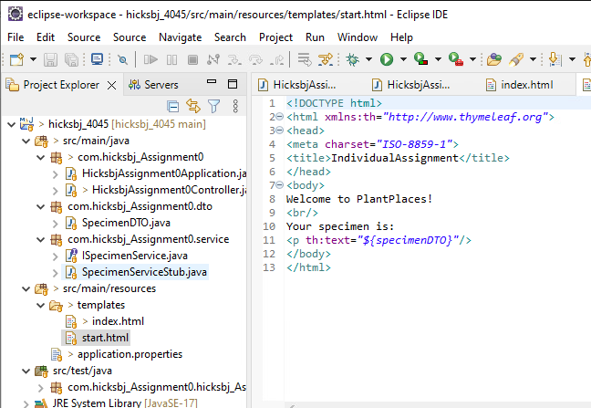
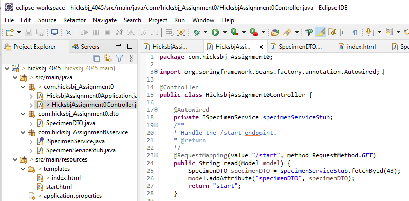
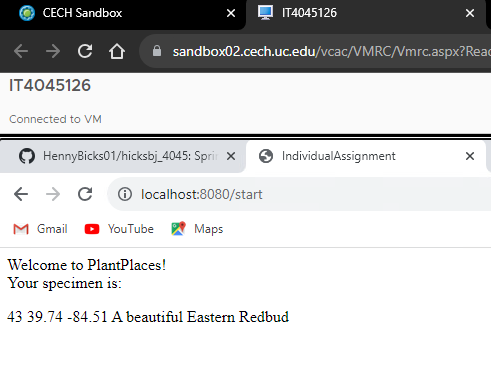
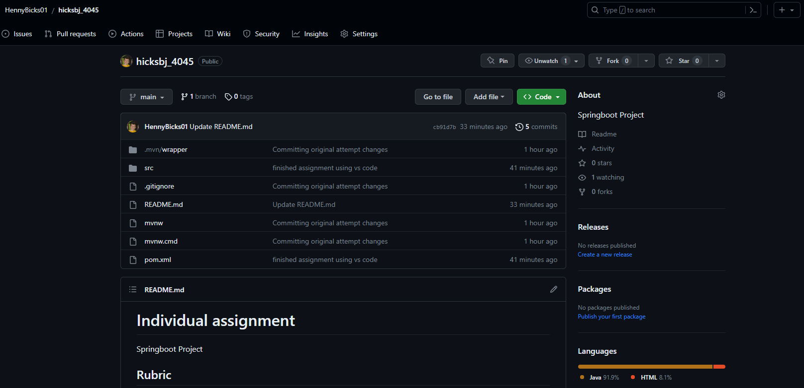

# Individual assignment
This project is my Spring Boot application that aims to create a simple home page accessible through a web browser. It utilizes Eclipse as the integrated development environment (IDE) for coding and testing. The home page is mapped to the "/index" endpoint and contains well-formatted HTML markup adhering to the XHTML Strict standard. The Spring Boot annotations are correctly implemented throughout the project to ensure the application functions as intended. Once the project is successfully built, users can run it using the Run or Debug option, and the browser should display the home page, identical to the provided screenshot. Finally, the completed project is committed and pushed to a GitHub repository named after my Bearcat ID, ensuring it is safely stored and shareable.

## Video Demonstration

## Rubric
- [x] Virtual Machine is activated.

- [x] Eclipse is installed and working.
      

- [x] The Eclipse environment contains a Spring Boot project with an Application class.

- [x] You can run the Spring Boot project, and see a response in the browser, by right-clicking on the
Application class and selecting either Run or Debug.

- [x] The Spring Boot project contains a simple home page, mapped to the /index endpoint. (Simple is fine,
don’t worry about spending too much time on the look and feel.) 

- [x] The home page contains well-formatted HTML markup: all tags are properly closed and conform to
XHTML Strict: 

index page:

start page:

- [x] All proper Spring Boot annotations are present 

*decided to use a picture of my controller class since it gives a good amount of annotation that wasn't necessarily present in other screenshots*

- [x] The project builds without error, and the browser home page is identical to the attached screenshot
below: 

- [x] All work is committed and pushed to a repository on github.com. The repository is named
yourBearcatId_4045 (bearcat ID is your 6+2). 

